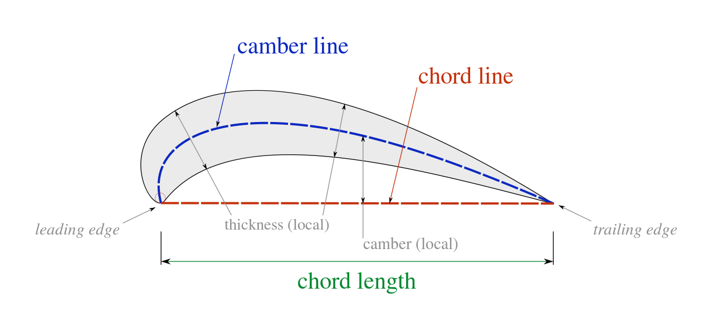
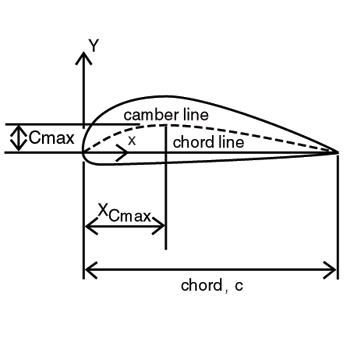
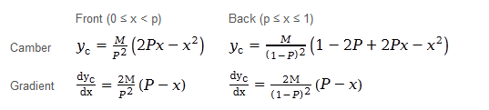
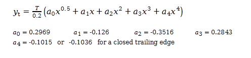
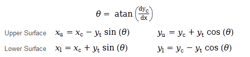
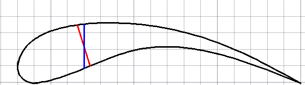

#NACA-4 Digit Design   
This should hopefully be a good guide to 4 Digit NACA designs. 
The NACA series was a system created by NACA (National Advisory Committee for Aeronautics) to classify foils by a set of numbers.
Classifying them is helpful because you can standerdize foil shapes. NACA created a bunch of different foil Series:
the 4 series, the 5 series, ... , all the way up to the 8 series. We are starting out with the 4 series because they are the simplest, have only a few constants to evolve, and are easiest to test. 
## Resources 
* [NACA airfoil wikipedia] (https://en.wikipedia.org/wiki/NACA_airfoil) There's no better place to start than wikipedia
* [NACA airfoil series pdf](http://people.clarkson.edu/~pmarzocc/AE429/The%20NACA%20airfoil%20series.pdf) A more formal description of the NACA foil series, also describes a bit more of the terminoligy around what a foil is.
* [NACA 4 digit airfoil generator] (http://airfoiltools.com/airfoil/naca4digit) My go to reference. It allows you to play with the Camber, Camber Position, and thickness to see how they effect the foil shape. It also shows the math of how you turn the digits into a foil cross-section, but lacks a bit on the context around that math. 

## Backgound 
A foil has a set of terminology that is used to describe its shape. 

In the picture above, there is a red dotted line, this is the *chord line* or chord. The chord line connects the leading edge to the trailing edge. All quantitve measurments of the foil are made in reference to the chord, normally as a percentage. Next there is the dotted blue line, this is the *camber line*, also called the *mean camber line*. This line runs through the foil such that at any givin point on the camber line, the upper and lower surfaces are the same distance from it. Finally, you will notice that the thickness increases and decreases around the camber line at a certain rate, this known as the *thickness distribution*. These are the characterstics of the foil in which the NACA 4 Digit Series are built from. 

## The (almost) 4 Digits 
An NACA 4 Digit foil, is called a NACA 4 Digit foil because the shape of the foil can be generated from 4 digits. An NACA 4 Digit foil is recognisable by the word **NACA** and the four digits that follow. The following shows how the NACA 4 Digits are broken down.
# **NACA MPXX**   
* M is the maximum camber
* P is the position of the maximum camber
* XX is the thickness of the foil 

(Its worth noting that 4 Digit NACA Series actually only have three numbers :laughing:)  
***

#### M: The Maximum Camber  
This basically controls how arched the foil is. The number is a percentage of the lenght of the chord, so if the Maximum Camber is 5, that means that the highest point of the mean camber line is 5% the length of the chord.   
#### P: The Maximum Camber Position  
This is where the Maximum Camber will lay with respect to the chord line. The Maximum Camber Position is inputed as a percentage of the chord line, so if the Maximum Camber Position was 50, the Maximum Camber would be 50% of the way down the chord. 
#### XX: Foil Thickness  
This is a bit of magic. This number is a percentage of the chord. What this percentage means is that the thickest part of the foil will be XX% of the chord. This Foil Thickness is fed into a thickness function that uniformly changes the thickness over the rest of the foil to give it a tear drop shape.

  

In the picture above, **Cmax** is the Maximum Camber, **X-Cmax** is the Maximum Camber Position, and the thickness isn't described on the picture :cry:. I would suggest playing with these three inputs in the foil generator in the resource section. 

##The Math  
I don't know why exactly the proccess the NACA people used to arrive at these equations but I do know how to use them. To start off, there are some simple equations that define camber and thickness. The camber and thickness equations on their own don't give you a foil shape, but they are the building blocks to get there. The final goal will be to create four equations that describe the upper and lower surfaces of the foil. 

#### Camber Equations  
The first line is the camber equation, it is piecewise at the Maximum Camber Position.
Next there is the derivative of the camber equation, called the gradient equation.  
  

#### Thickness Distribution  
Next is the equation that defines the thickness throughout the foil.
It's not that hard to see why it makes the teardrop shape, but how the exact constants were decided is beyond me. 
  

#### Bringing it all together: Upper and Lower Functions 
This section gets a bit more complicated. The gradient function (derivative of the camber function) is mapped into radiants using arctan. This gets fed into four parametric functions that define upper and lower curves. For both the upper and lower functions there is a an x and y function. 
  
  
The y functions are fairly straight forward. In the equations above,`yc` is the camber function at a given x, the `yt`  is the thickness distribution at that given x. The x function inputs are decently straight forward: the `xc` is just the x coordinate and the `yt` is the output of the thickness distribution at that same given x. The output of the x function is not so clear. Afterall, an x value is an x value, right? Apparently not :cry:. In the picture below, the x coordinate, in blue, get's mapped to do different adjusted x values on the upper and lower surface of the foil. This is the purpose of the x functions.

