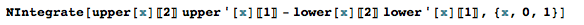

#model.clj API 
`model.clj` is a class that will take a four digit NACA foil and the environment that foil will be preforming in and return
a lift force for that given foil. The function that starts everything in motion is called `(lift-function)`. It takes in an 
*individual* (the foil) and a set of *run constants*, all of the aspects of the environment that are plugged into the equation of lift. For this model. We are using *thin aerofoil theory* as our method of determining lift. It is the easiest model we have come across, so it is a good starting point for what we are doing. You can read a full discription of what **thin aerofoil theory** is and how we use it here.  

##Functions  
#### `(lift-function individual run-constants)`  
This is the function that takes an NACA 4 Digit Foil, and derives from it, its area and coefficient of lift. The NACA 4 Digit Foil is refered to as an `individual` and is represented as a hashmap of *camber*, *camber posisition*, and *thinkness*. 
To see more on 4 Digit NACA foils, see the [NACA 4 Digit Guide](https://github.com/morrislenny/hydrofoil/blob/master/docs/NACA-4%20Digit%20Design.md).
It also recives, from the hashmap of run constants, its *fluid dencity*, *fluid velocity*, and foil *angle of attack*.
To get a better understanding of the equation in place, see the **thin aerofoil theory link**. 
#### `(round-double n)`  
A very simple function that takes a double and rounds it to four decimle places which is the expected accuracy of this model.
#### `(coefficient-of-lift individual run-constants)`
This function gets directly called from `(lift-function)`. This function, on its own, solves for the coefficient of lift. 
See the equation in the **thin aerofoil theory guide**. Again the *individual* and *run-constants* are hashmaps. 
## Area Functions 
Area functions constitute the bulk of the code is this class so it is worthwhile to break it up into its own section.  

Because the 4 Digit NACA Foil is a set of parametric equations, taking the integral is not as simple as finding the integral of the top of the foil minus the integral of the bottom. To find the area properly, we must multiply the y value of the upper or lower function at a certain point by the derivative of the x value of the upper or lower function. The integral in mathematica will look like this:  

`upper[x][2]` is the upper function y coordinate and `upper[x][1]` is the x coordinate. The same goes for the lower functions. 
Unfortunatly, this integral is not solvable due to the complexity of its parematric equations, but it is possible to approximate using numerical integration. 

#### `(area individual)`

