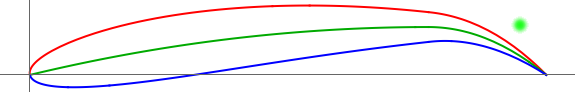

# LC11-Slow-R2  
Linear Combination Scoring (Lift: 1, Drag: 1). Slow Velocity, Run 2: 3,000,000 generations.  
### Run Constants  
| V-Infinity (V∞) | Density (ρ) | angle-of-attack (AOT) |
|-----------------|-------------|----------------------|
|30 m/s           | 0.7708kg/m^3| 2.1 degrees          |  
### Wing Characteristics  
| Span   | Root-Chord | Min-Lift |
|--------|------------|----------|
| 11.24m | 2.67       | 27585N   |  
### Highest Scoring Individual  
**Standard NACA:** (NACA 9.27, 7.72)    
**Generation:** 1236133  

| Lift         | Drag        | Cl-2D         |CL-3D       |CD-Induced    |Score|
|--------------|------------ |---------------|------------|--------------|-----|
| 68835.05555N | 34417.7614N | 2.033652514   |8.419532807 |4.20979498    |1236133|  

  

### Progress Over Time  


  

**Number of Successful Generations:** 12  

  

### Raw Data  
```CSV
Run 2: Slow Speed | V-infity: 30 m/s | p = 0.7708kg/m^3 | a = 2.1

:thickness , 34.91 , :generation , 1236133 , :positon-camber , 7.72 , :CD-Induced , 4.20979497958395 , :Lift , 68835.05555368299 , :corrected-thickness , 0.34909999999999997 , :score , 34417.2941495434 , :cl-2D , 2.03365251385833 , :Drag , 34417.761404139594 , :corrected-position-camber , 0.772 , :corrected-max-camber , 0.09269999999999999 , :max-camber , 9.27 , :CL-3D , 8.419532807105332 ,
:thickness , 32.68 , :generation , 522997 , :positon-camber , 7.64 , :CD-Induced , 4.209800875639236 , :Lift , 68835.10375735481 , :corrected-thickness , 0.3268 , :score , 34417.29414919933 , :cl-2D , 2.0336538023793285 , :Drag , 34417.809608155476 , :corrected-position-camber , 0.764 , :corrected-max-camber , 0.09449999999999999 , :max-camber , 9.45 , :CL-3D , 8.419538703118532 ,
:thickness , 23.11 , :generation , 2845 , :positon-camber , 8.27 , :CD-Induced , 4.238062347933741 , :Lift , 69065.7711199735 , :corrected-thickness , 0.2311 , :score , 34416.9059342711 , :cl-2D , 2.039819717325454 , :Drag , 34648.86518570241 , :corrected-position-camber , 0.827 , :corrected-max-camber , 0.0799 , :max-camber , 7.99 , :CL-3D , 8.447752691056438 ,
:thickness , 18.310000000000002 , :generation , 2315 , :positon-camber , 8.31296040892695 , :CD-Induced , 4.24872717586922 , :Lift , 69152.61643990602 , :corrected-thickness , 0.1831 , :score , 34416.5594776255 , :cl-2D , 2.042141159119793 , :Drag , 34736.05696228052 , :corrected-position-camber , 0.8312960408926949 , :corrected-max-camber , 0.0787 , :max-camber , 7.87 , :CL-3D , 8.458375142283272 ,
:thickness , 23.94 , :generation , 986 , :positon-camber , 8.51 , :CD-Induced , 4.14973767732407 , :Lift , 68342.28832309616 , :corrected-thickness , 0.2394 , :score , 34415.533704270645 , :cl-2D , 2.0204804690681937 , :Drag , 33926.754618825515 , :corrected-position-camber , 0.851 , :corrected-max-camber , 0.0726 , :max-camber , 7.26 , :CL-3D , 8.359260176672764 ,
:thickness , 17.98 , :generation , 558 , :positon-camber , 7.67388766981083 , :CD-Induced , 4.106585684617605 , :Lift , 67986.02329892055 , :corrected-thickness , 0.17980000000000002 , :score , 34412.06376780999 , :cl-2D , 2.0109572326102594 , :Drag , 33573.959531110566 , :corrected-position-camber , 0.7673887669810829 , :corrected-max-camber , 0.09269999999999999 , :max-camber , 9.27 , :CL-3D , 8.315683760049824 ,
:thickness , 15.53 , :generation , 259 , :positon-camber , 8.481803921465112 , :CD-Induced , 4.706688017651688 , :Lift , 72784.16438750677 , :corrected-thickness , 0.1553 , :score , 34303.98519092551 , :cl-2D , 2.139215212048104 , :Drag , 38480.17919658126 , :corrected-position-camber , 0.8481803921465112 , :corrected-max-camber , 0.0783 , :max-camber , 7.83 , :CL-3D , 8.902566504365561 ,
:thickness , 9.04 , :generation , 215 , :positon-camber , 8.498931552539794 , :CD-Induced , 3.7295193462810747 , :Lift , 64789.64890102867 , :corrected-thickness , 0.0904 , :score , 34298.4473971705 , :cl-2D , 1.9255157013523143 , :Drag , 30491.201503858163 , :corrected-position-camber , 0.8498931552539795 , :corrected-max-camber , 0.0692 , :max-camber , 6.92 , :CL-3D , 7.924720479925001 ,
:thickness , 0.14000000000000057 , :generation , 46 , :positon-camber , 8.979472403490874 , :CD-Induced , 4.728746216888942 , :Lift , 72954.51888443201 , :corrected-thickness , 0.0014000000000000056 , :score , 34293.99982758805 , :cl-2D , 2.143768917985547 , :Drag , 38660.51905684396 , :corrected-position-camber , 0.8979472403490873 , :corrected-max-camber , 0.0632 , :max-camber , 6.32 , :CL-3D , 8.92340334780475 ,
:thickness , 10.14 , :generation , 6 , :positon-camber , 7.568236699618618 , :CD-Induced , 1.574737668303163 , :Lift , 42100.11696004786 , :corrected-thickness , 0.1014 , :score , 29225.63124171347 , :cl-2D , 1.3190071666068084 , :Drag , 12874.48571833439 , :corrected-position-camber , 0.7568236699618618 , :corrected-max-camber , 0.0581 , :max-camber , 5.81 , :CL-3D , 5.1494592846177945 ,
:thickness , 15.12 , :generation , 5 , :positon-camber , 5.718830268475918 , :CD-Induced , 0.7986820787345948 , :Lift , 29982.384139849357 , :corrected-thickness , 0.1512 , :score , 23452.648284074687 , :cl-2D , 0.9950909044144722 , :Drag , 6529.735855774671 , :corrected-position-camber , 0.5718830268475917 , :corrected-max-camber , 0.0558 , :max-camber , 5.58 , :CL-3D , 3.6672835500775545 ,
:thickness , 6.67 , :generation , 3 , :positon-camber , 1.7430927645199938 , :CD-Induced , 0.15564805826652917 , :Lift , 13235.825959517906 , :corrected-thickness , 0.0667 , :score , 11963.30372068801 , :cl-2D , 0.5474426016463484 , :Drag , 1272.5222388298944 , :corrected-position-camber , 0.1743092764519994 , :corrected-max-camber , 0.0326 , :max-camber , 3.26 , :CL-3D , 1.6189348581027607 , 
```
