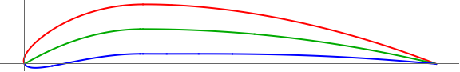

# LC12-Slow-R1  
Linear Combination Scoring (Lift: 1, Drag: 2). Slow Velocity, Run1: 3,000,000 generations.  
### Run Constants  
| V-Infinity (V∞) | Density (ρ) | angle-of-attack (AOT) |
|-----------------|-------------|----------------------|
|30 m/s           | 0.7708kg/m^3| 2.1 degrees          |  
### Wing Characteristics  
| Span   | Root-Chord | Min-Lift |
|--------|------------|----------|
| 11.24m | 2.67       | 27585N   |  
### Highest Scoring Individual  
**Standard NACA:** (NACA: 8.46, 2.877625498)  
**Generation:** 441895  

| Lift         | Drag        | Cl-2D         |CL-3D       |CD-Induced    |Score|
|--------------|------------ |---------------|------------|--------------|-----|
| 34417.4765N  | 8604.414714N| 1.113644314   |4.209760132 |1.052445609   |17208.64708|   

  

### Progress Over Time  


**Number of Successful Generations:** 13  

  

### Raw Data  
```CSV  
Run 1: Slow Speed | V-infity: 30 m/s | p = 0.7708kg/m^3 | a = 2.1

:thickness , 1.12 , :generation , 441895 , :positon-camber , 2.877625498363039 , :CD-Induced , 1.0524456090718286 , :Lift , 34417.476502422665 , :corrected-thickness , 0.011200000000000002 , :score , 17208.64707508156 , :cl-2D , 1.1136443138581862 , :Drag , 8604.414713670552 , :corrected-position-camber , 0.2877625498363039 , :corrected-max-camber , 0.08460000000000001 , :max-camber , 8.46 , :CL-3D , 4.209760131942248 ,
:thickness , 1.17 , :generation , 253222 , :positon-camber , 3.0283815150158273 , :CD-Induced , 1.0524475406609088 , :Lift , 34417.50808618847 , :corrected-thickness , 0.011699999999999999 , :score , 17208.64707489973 , :cl-2D , 1.1136451581163915 , :Drag , 8604.43050564437 , :corrected-position-camber , 0.3028381515015827 , :corrected-max-camber , 0.0837 , :max-camber , 8.37 , :CL-3D , 4.209763995098168 ,
:thickness , 1.27 , :generation , 139246 , :positon-camber , 4.559992589804302 , :CD-Induced , 1.0524667141404918 , :Lift , 34417.82159368295 , :corrected-thickness , 0.0127 , :score , 17208.647071523123 , :cl-2D , 1.113653538411393 , :Drag , 8604.587261079914 , :corrected-position-camber , 0.45599925898043014 , :corrected-max-camber , 0.0737 , :max-camber , 7.37 , :CL-3D , 4.209802341644326 ,
:thickness , 7.44 , :generation , 133835 , :positon-camber , 8.644829831136132 , :CD-Induced , 1.0524702397103267 , :Lift , 34417.879240319344 , :corrected-thickness , 0.07440000000000001 , :score , 17208.64707059141 , :cl-2D , 1.1136550793500541 , :Drag , 8604.616084863967 , :corrected-position-camber , 0.8644829831136132 , :corrected-max-camber , 0.034 , :max-camber , 3.4 , :CL-3D , 4.209809392670034 ,
:thickness , 11.17 , :generation , 78594 , :positon-camber , 5.543162780990182 , :CD-Induced , 1.052500732397697 , :Lift , 34418.37782260249 , :corrected-thickness , 0.1117 , :score , 17208.64705850425 , :cl-2D , 1.1136684068356448 , :Drag , 8604.865382049118 , :corrected-position-camber , 0.5543162780990182 , :corrected-max-camber , 0.0659 , :max-camber , 6.59 , :CL-3D , 4.209870376566339 ,
:thickness , 8.73 , :generation , 49743 , :positon-camber , 3.8925588980837733 , :CD-Induced , 1.0522305144345465 , :Lift , 34413.95926939469 , :corrected-thickness , 0.0873 , :score , 17208.64691399708 , :cl-2D , 1.1135502955304521 , :Drag , 8602.656177698806 , :corrected-position-camber , 0.38925588980837733 , :corrected-max-camber , 0.0783 , :max-camber , 7.83 , :CL-3D , 4.209329922964699 ,
:thickness , 9.71 , :generation , 21194 , :positon-camber , 6.701878794466884 , :CD-Induced , 1.0527692013606134 , :Lift , 34422.76721481129 , :corrected-thickness , 0.0971 , :score , 17208.646640399307 , :cl-2D , 1.1137857386450407 , :Drag , 8607.060287205992 , :corrected-position-camber , 0.6701878794466885 , :corrected-max-camber , 0.0559 , :max-camber , 5.59 , :CL-3D , 4.210407263351828 ,
:thickness , 14.59 , :generation , 530 , :positon-camber , 4.0048611416654465 , :CD-Induced , 1.057424522232477 , :Lift , 34498.79160017387 , :corrected-thickness , 0.1459 , :score , 17208.550585785804 , :cl-2D , 1.1158179285858083 , :Drag , 8645.120507194033 , :corrected-position-camber , 0.40048611416654467 , :corrected-max-camber , 0.0776 , :max-camber , 7.76 , :CL-3D , 4.2197061562132 ,
:thickness , 10.85 , :generation , 241 , :positon-camber , 4.2266370539840095 , :CD-Induced , 1.0630390977429958 , :Lift , 34590.2589489876 , :corrected-thickness , 0.1085 , :score , 17208.2124565448 , :cl-2D , 1.1182629207456454 , :Drag , 8691.023246221399 , :corrected-position-camber , 0.4226637053984009 , :corrected-max-camber , 0.0764 , :max-camber , 7.64 , :CL-3D , 4.230893949088816 ,
:thickness , 15.01 , :generation , 9 , :positon-camber , 3.1069467226913234 , :CD-Induced , 1.2424544439917715 , :Lift , 37395.50747794068 , :corrected-thickness , 0.1501 , :score , 17079.791004238254 , :cl-2D , 1.1932493585143027 , :Drag , 10157.858236851212 , :corrected-position-camber , 0.31069467226913233 , :corrected-max-camber , 0.091 , :max-camber , 9.1 , :CL-3D , 4.574016822043928 ,
:thickness , 9.7 , :generation , 3 , :positon-camber , 4.6105971976781825 , :CD-Induced , 0.687202849803872 , :Lift , 27811.324360902112 , :corrected-thickness , 0.09699999999999999 , :score , 16574.68037443798 , :cl-2D , 0.9370568167656252 , :Drag , 5618.321993232066 , :corrected-position-camber , 0.46105971976781823 , :corrected-max-camber , 0.058499999999999996 , :max-camber , 5.85 , :CL-3D , 3.401731225204692 ,
:thickness , 16.14 , :generation , 2 , :positon-camber , 3.299360767842574 , :CD-Induced , 0.005912498559335286 , :Lift , 2579.673357040256 , :corrected-thickness , 0.16140000000000002 , :score , 2482.9964567615484 , :cl-2D , 0.26259549603990945 , :Drag , 48.33845013935385 , :corrected-position-camber , 0.3299360767842574 , :corrected-max-camber , 0.003 , :max-camber , 0.3 , :CL-3D , 0.3155317343250678 ,
:thickness , 24.21 , :generation , 1 , :positon-camber , 3.86 , :CD-Induced , 0.002590058168771107 , :Lift , 1707.3947952912238 , :corrected-thickness , 0.2421 , :score , 1665.0440373526903 , :cl-2D , 0.2392788232344741 , :Drag , 21.17537896926674 , :corrected-position-camber , 0.386 , :corrected-max-camber , 8.0E-4 , :max-camber , 0.08 , :CL-3D , 0.20883932435304317 ,
```
