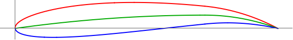

# LC27-Slow-R3  
Linear Combination Scoring (Lift: 1, Drag: 2). Slow Velocity, Run3: 3,000,000 generations.  
### Run Constants  
| V-Infinity (V∞) | Density (ρ) | angle-of-attack (AOT) |
|-----------------|-------------|----------------------|
|30 m/s           | 0.7708kg/m^3| 2.1 degrees          |  
### Wing Characteristics  
| Span   | Root-Chord | Min-Lift |
|--------|------------|----------|
| 11.24m | 2.67       | 27585N   |  
### Highest Scoring Individual  
**Standard NACA:** (NACA: 5.08, 7.22)  
**Generation:** 10716  

| Lift         | Drag        | Cl-2D         |CL-3D       |CD-Induced    |Score|
|--------------|------------ |---------------|------------|--------------|-----|
| 34417.4765N  | 8604.414714N| 1.113644314   |4.209760132 |1.052445609   |17208.64708|   

  

### Progress Over Time  


  

**Number of Successful Generations:** 5

  

### Raw Data  
```SQL
Run 3: Slow Speed | V-infity: 30 m/s | p = 0.7708kg/m^3 | a = 2.1

:thickness , 20.2 , :generation , 329256 , :positon-camber , 7.22 , :CD-Induced , 1.05245057673873 , :Lift , 34417.5577295928 , :corrected-thickness , 0.20199999999999999 , :score , 17208.647074555345 , :cl-2D , 1.1136464851225414 , :Drag , 8604.455327518728 , :corrected-position-camber , 0.722 , :corrected-max-camber , 0.0508 , :max-camber , 5.08 , :CL-3D , 4.209770067211688 ,
:thickness , 15.63 , :generation , 10716 , :positon-camber , 6.042378138845794 , :CD-Induced , 1.0524046100301703 , :Lift , 34416.80611276855 , :corrected-thickness , 0.1563 , :score , 17208.64707210444 , :cl-2D , 1.113626393830224 , :Drag , 8604.079520332056 , :corrected-position-camber , 0.6042378138845794 , :corrected-max-camber , 0.0617 , :max-camber , 6.17 , :CL-3D , 4.209678133494785 ,
:thickness , 12.36 , :generation , 338 , :positon-camber , 5.778044837669015 , :CD-Induced , 1.0475652586454753 , :Lift , 34337.58423895359 , :corrected-thickness , 0.12359999999999999 , :score , 17208.554772112897 , :cl-2D , 1.1115087325786703 , :Drag , 8564.514733420347 , :corrected-position-camber , 0.5778044837669015 , :corrected-max-camber , 0.0638 , :max-camber , 6.38 , :CL-3D , 4.199988141088152 ,
:thickness , 12.73 , :generation , 18 , :positon-camber , 3.4593402908814928 , :CD-Induced , 1.092145028185875 , :Lift , 35060.600552799624 , :corrected-thickness , 0.1273 , :score , 17202.63493636779 , :cl-2D , 1.130835511387881 , :Drag , 8928.982808215917 , :corrected-position-camber , 0.3459340290881493 , :corrected-max-camber , 0.0827 , :max-camber , 8.27 , :CL-3D , 4.288423597782911 ,
:thickness , 9.28 , :generation , 2 , :positon-camber , 8.08796259200686 , :CD-Induced , 0.764450629973327 , :Lift , 29332.82665657885 , :corrected-thickness , 0.0928 , :score , 16833.08283757395 , :cl-2D , 0.9777277363052256 , :Drag , 6249.87190950245 , :corrected-position-camber , 0.8087962592006861 , :corrected-max-camber , 0.0348 , :max-camber , 3.48 , :CL-3D , 3.58783318141719 ,
```
