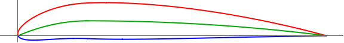

# LC27-Slow-R1  
Linear Combination Scoring (Lift: 2, Drag: 7). Slow Velocity, Run1: 3,000,000 generations.  
### Run Constants  
| V-Infinity (V∞) | Density (ρ) | angle-of-attack (AOT) |
|-----------------|-------------|----------------------|
|30 m/s           | 0.7708kg/m^3| 2.1 degrees          |  
### Wing Characteristics  
| Span   | Root-Chord | Min-Lift |
|--------|------------|----------|
| 11.24m | 2.67       | 27585N   |  
### Highest Scoring Individual  
**Standard NACA:** (NACA: 4.89, 2.26493157)  
**Generation:** 2898613   

| Lift         | Drag        | Cl-2D         |CL-3D       |CD-Induced    |Score|
|--------------|------------ |---------------|------------|--------------|-----|
| 19667.03114N | 2809.576722N| 0.7193536327  |2.405565196 |0.3436522741  |19667.02523|    

  

## Progress Over Time  


  

**Number of Successful Generations:** 12  

  

### Raw Data  
```SQL
Run 1: Slow Speed | V-infity: 30 m/s | p = 0.7708kg/m^3 | a = 2.1

:thickness , 0.92 , :generation , 2898613 , :positon-camber , 2.264931570028213 , :CD-Induced , 0.3436522741314947 , :Lift , 19667.03113995817 , :corrected-thickness , 0.0092 , :score , 19667.025229214934 , :cl-2D , 0.7193536327237008 , :Drag , 2809.576721528772 , :corrected-position-camber , 0.2264931570028213 , :corrected-max-camber , 0.0489 , :max-camber , 4.89 , :CL-3D , 2.4055651959502242 ,
:thickness , 2.15 , :generation , 2691310 , :positon-camber , 7.129864272932959 , :CD-Induced , 0.34365113059619595 , :Lift , 19666.998417982017 , :corrected-thickness , 0.0215 , :score , 19667.025229180166 , :cl-2D , 0.7193527580402624 , :Drag , 2809.567372397695 , :corrected-position-camber , 0.712986427293296 , :corrected-max-camber , 0.0286 , :max-camber , 2.86 , :CL-3D , 2.405561193574552 ,
:thickness , 1.72 , :generation , 2214329 , :positon-camber , 7.828876610820254 , :CD-Induced , 0.34365078948038813 , :Lift , 19666.988657028072 , :corrected-thickness , 0.0172 , :score , 19667.02522914871 , :cl-2D , 0.7193524971225013 , :Drag , 2809.564583558205 , :corrected-position-camber , 0.7828876610820255 , :corrected-max-camber , 0.0245 , :max-camber , 2.45 , :CL-3D , 2.4055599996673007 ,
:thickness , 8.94 , :generation , 476722 , :positon-camber , 3.967059780123085 , :CD-Induced , 0.34365059953038696 , :Lift , 19666.983221648392 , :corrected-thickness , 0.0894 , :score , 19667.025229126986 , :cl-2D , 0.7193523518306473 , :Drag , 2809.563030595685 , :corrected-position-camber , 0.3967059780123085 , :corrected-max-camber , 0.043 , :max-camber , 4.3 , :CL-3D , 2.4055593348409685 ,
:thickness , 7.47 , :generation , 138820 , :positon-camber , 4.787783248156152 , :CD-Induced , 0.3436442134437798 , :Lift , 19666.80048423747 , :corrected-thickness , 0.0747 , :score , 19667.025226648453 , :cl-2D , 0.7193474671199518 , :Drag , 2809.5108202609263 , :corrected-position-camber , 0.47877832481561516 , :corrected-max-camber , 0.0398 , :max-camber , 3.98 , :CL-3D , 2.4055369833862623 ,
:thickness , 1.08 , :generation , 123955 , :positon-camber , 4.507044454996704 , :CD-Induced , 0.3436746362337339 , :Lift , 19667.671014971143 , :corrected-thickness , 0.0108 , :score , 19667.02520801172 , :cl-2D , 0.7193707370719766 , :Drag , 2809.759545990081 , :corrected-position-camber , 0.45070444549967037 , :corrected-max-camber , 0.0409 , :max-camber , 4.09 , :CL-3D , 2.4056434620113296 ,
:thickness , 1.3 , :generation , 41422 , :positon-camber , 3.2405016630263974 , :CD-Induced , 0.34362911475601454 , :Lift , 19666.36842961527 , :corrected-thickness , 0.013000000000000001 , :score , 19667.02520728226 , :cl-2D , 0.7193359179695983 , :Drag , 2809.387378849755 , :corrected-position-camber , 0.3240501663026397 , :corrected-max-camber , 0.045700000000000005 , :max-camber , 4.57 , :CL-3D , 2.4054841367946995 ,
:thickness , 2.39 , :generation , 311 , :positon-camber , 1.347058646250672 , :CD-Induced , 0.3413829995061023 , :Lift , 19601.98891609191 , :corrected-thickness , 0.0239 , :score , 19666.810162526384 , :cl-2D , 0.717615004355503 , :Drag , 2791.0239528082047 , :corrected-position-camber , 0.1347058646250672 , :corrected-max-camber , 0.051100000000000007 , :max-camber , 5.11 , :CL-3D , 2.3976095818625445 ,
:thickness , 8.46 , :generation , 110 , :positon-camber , 3.5919134824454693 , :CD-Induced , 0.36437014515009186 , :Lift , 20251.19181058587 , :corrected-thickness , 0.08460000000000001 , :score , 19649.673820408767 , :cl-2D , 0.7349686940356726 , :Drag , 2978.9585429661392 , :corrected-position-camber , 0.3591913482445469 , :corrected-max-camber , 0.0458 , :max-camber , 4.58 , :CL-3D , 2.4770165791358574 ,
:thickness , 10.51 , :generation , 93 , :positon-camber , 5.628685129624105 , :CD-Induced , 0.36603103718333946 , :Lift , 20297.29438158757 , :corrected-thickness , 0.1051 , :score , 19646.826993855728 , :cl-2D , 0.7362010510035895 , :Drag , 2992.537395617059 , :corrected-position-camber , 0.5628685129624105 , :corrected-max-camber , 0.0374 , :max-camber , 3.74 , :CL-3D , 2.482655597015897 ,
:thickness , 5.69 , :generation , 21 , :positon-camber , 7.173114786250187 , :CD-Induced , 0.2801866470727515 , :Lift , 17758.362272636932 , :corrected-thickness , 0.056900000000000006 , :score , 19481.79160901431 , :cl-2D , 0.66833345473834 , :Drag , 2290.704705179936 , :corrected-position-camber , 0.7173114786250187 , :corrected-max-camber , 0.0254 , :max-camber , 2.54 , :CL-3D , 2.1721071124628213 ,
:thickness , 5.04 , :generation , 1 , :positon-camber , 2.357063798085372 , :CD-Induced , 0.02387139723749337 , :Lift , 5183.440458661378 , :corrected-thickness , 0.0504 , :score , 9000.733537363467 , :cl-2D , 0.3321961812250669 , :Drag , 195.16391142275572 , :corrected-position-camber , 0.2357063798085372 , :corrected-max-camber , 0.0101 , :max-camber , 1.01 , :CL-3D , 0.6340104855634351 , 
```
