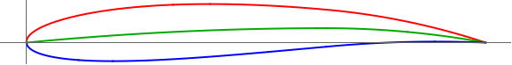

# LC27-Slow-R  
Linear Combination Scoring (Lift: 2, Drag: 7). Slow Velocity, Run2: 3,000,000 generations.  
### Run Constants  
| V-Infinity (V∞) | Density (ρ) | angle-of-attack (AOT) |
|-----------------|-------------|----------------------|
|30 m/s           | 0.7708kg/m^3| 2.1 degrees          |  
### Wing Characteristics  
| Span   | Root-Chord | Min-Lift |
|--------|------------|----------|
| 11.24m | 2.67       | 27585N   |  
### Highest Scoring Individual  
**Standard NACA:** (NACA: 3.18, 6.529754831)  
**Generation:** 346790  

| Lift         | Drag        | Cl-2D         |CL-3D       |CD-Induced    |Score|
|--------------|------------ |---------------|------------|--------------|-----|
| 19667.06498N | 2809.586391N| 0.7193545374  |2.405569335 |0.3436534569  |19667.02523|     

 

 ## Progress Over Time  

 

 

 

   

 **Number of Successful Generations:** 14  


### Raw Data  
```SQL
Run 2: Slow Speed | V-infity: 30 m/s | p = 0.7708kg/m^3 | a = 2.1

:thickness , 19.46 , :generation , 346790 , :positon-camber , 6.529754830954737 , :CD-Induced , 0.3436534568603507 , :Lift , 19667.06498339088 , :corrected-thickness , 0.1946 , :score , 19667.025229136365 , :cl-2D , 0.71935453738453 , :Drag , 2809.586391092199 , :corrected-position-camber , 0.6529754830954737 , :corrected-max-camber , 0.0318 , :max-camber , 3.18 , :CL-3D , 2.4055693354964145 ,
:thickness , 9.88 , :generation , 52200 , :positon-camber , 2.7538679844999012 , :CD-Induced , 0.3436592144008121 , :Lift , 19667.229732858494 , :corrected-thickness , 0.09880000000000001 , :score , 19667.025227090227 , :cl-2D , 0.719358941263749 , :Drag , 2809.633462660966 , :corrected-position-camber , 0.27538679844999014 , :corrected-max-camber , 0.0473 , :max-camber , 4.73 , :CL-3D , 2.4055894867628935 ,
:thickness , 4.81 , :generation , 22599 , :positon-camber , 2.4421052327850084 , :CD-Induced , 0.3436115989924588 , :Lift , 19665.867197568263 , :corrected-thickness , 0.0481 , :score , 19667.025161029625 , :cl-2D , 0.719322519653794 , :Drag , 2809.2441763009856 , :corrected-position-camber , 0.24421052327850085 , :corrected-max-camber , 0.0483 , :max-camber , 4.83 , :CL-3D , 2.4054228287935686 ,
:thickness , 3.6299999999999994 , :generation , 16059 , :positon-camber , 3.4963469703531462 , :CD-Induced , 0.34359730320975596 , :Lift , 19665.458099200856 , :corrected-thickness , 0.03629999999999999 , :score , 19667.02510434291 , :cl-2D , 0.7193115841416808 , :Drag , 2809.127299151258 , :corrected-position-camber , 0.34963469703531463 , :corrected-max-camber , 0.044800000000000006 , :max-camber , 4.48 , :CL-3D , 2.4053727900873016 ,
:thickness , 12.6 , :generation , 11214 , :positon-camber , 8.467598044279168 , :CD-Induced , 0.3438773673276625 , :Lift , 19673.47106566 , :corrected-thickness , 0.126 , :score , 19667.02311660401 , :cl-2D , 0.7195257768609816 , :Drag , 2811.417002102284 , :corrected-position-camber , 0.8467598044279168 , :corrected-max-camber , 0.0202 , :max-camber , 2.02 , :CL-3D , 2.406352892935223 ,
:thickness , 5.09 , :generation , 10855 , :positon-camber , 1.060408098824562 , :CD-Induced , 0.3439136155529018 , :Lift , 19674.507931831486 , :corrected-thickness , 0.0509 , :score , 19667.022382276846 , :cl-2D , 0.7195534930864211 , :Drag , 2811.7133544837325 , :corrected-position-camber , 0.1060408098824562 , :corrected-max-camber , 0.052000000000000005 , :max-camber , 5.2 , :CL-3D , 2.406479716814091 ,
:thickness , 7.46 , :generation , 664 , :positon-camber , 7.29679745526304 , :CD-Induced , 0.34327686209680447 , :Lift , 19656.2858921724 , :corrected-thickness , 0.0746 , :score , 19667.019364915493 , :cl-2D , 0.7190664040357324 , :Drag , 2806.507488489901 , :corrected-position-camber , 0.729679745526304 , :corrected-max-camber , 0.0276 , :max-camber , 2.76 , :CL-3D , 2.4042508951840658 ,
:thickness , 5.27 , :generation , 197 , :positon-camber , 7.9927209359784435 , :CD-Induced , 0.3458885794147347 , :Lift , 19730.918634409343 , :corrected-thickness , 0.0527 , :score , 19666.81765500661 , :cl-2D , 0.7210613942918518 , :Drag , 2827.8599448302966 , :corrected-position-camber , 0.7992720935978443 , :corrected-max-camber , 0.0235 , :max-camber , 2.35 , :CL-3D , 2.4133795697626477 ,
:thickness , 9.710000000000003 , :generation , 30 , :positon-camber , 7.621878794466884 , :CD-Induced , 0.304176329425631 , :Lift , 18502.98947314334 , :corrected-thickness , 0.09710000000000002 , :score , 19598.12923576447 , :cl-2D , 0.68823790906933 , :Drag , 2486.8356729317447 , :corrected-position-camber , 0.7621878794466884 , :corrected-max-camber , 0.0241 , :max-camber , 2.41 , :CL-3D , 2.263185896278683 ,
:thickness , 18.610000000000003 , :generation , 23 , :positon-camber , 7.706092639898845 , :CD-Induced , 0.4184127240298516 , :Lift , 21701.094385100383 , :corrected-thickness , 0.18610000000000004 , :score , 19456.65089539165 , :cl-2D , 0.7737256982912006 , :Drag , 3420.791124972731 , :corrected-position-camber , 0.7706092639898845 , :corrected-max-camber , 0.027999999999999997 , :max-camber , 2.8 , :CL-3D , 2.654360843552279 ,
:thickness , 27.76 , :generation , 8 , :positon-camber , 4.69 , :CD-Induced , 0.61652418232798 , :Lift , 26342.334018083508 , :corrected-thickness , 0.2776 , :score , 17401.31666844641 , :cl-2D , 0.8977895818708845 , :Drag , 5040.478766817229 , :corrected-position-camber , 0.46900000000000003 , :corrected-max-camber , 0.054900000000000004 , :max-camber , 5.49 , :CL-3D , 3.2220522478987683 ,
:thickness , 28.31 , :generation , 5 , :positon-camber , 6.2 , :CD-Induced , 0.14938074811766638 , :Lift , 12966.61181286468 , :corrected-thickness , 0.28309999999999996 , :score , 17384.242783636946 , :cl-2D , 0.5402463016942767 , :Drag , 1221.2829774417733 , :corrected-position-camber , 0.62 , :corrected-max-camber , 0.0212 , :max-camber , 2.12 , :CL-3D , 1.5860060354025889 ,
:thickness , 31.13 , :generation , 3 , :positon-camber , 5.43 , :CD-Induced , 0.14294335301140587 , :Lift , 12684.14438105086 , :corrected-thickness , 0.31129999999999997 , :score , 17187.71662146427 , :cl-2D , 0.5326957312978333 , :Drag , 1168.653162948207 , :corrected-position-camber , 0.5429999999999999 , :corrected-max-camber , 0.0229 , :max-camber , 2.29 , :CL-3D , 1.5514561423289863 ,
:thickness , 24.49 , :generation , 1 , :positon-camber , 5.65 , :CD-Induced , 0.005277602256851369 , :Lift , 2437.235653884777 , :corrected-thickness , 0.24489999999999998 , :score , 4572.436934836392 , :cl-2D , 0.258788027342095 , :Drag , 43.147767561880336 , :corrected-position-camber , 0.5650000000000001 , :corrected-max-camber , 0.0021 , :max-camber , 0.21 , :CL-3D , 0.29810952256043843 , 
```
