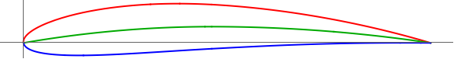

# LC27-Slow-R3  
Linear Combination Scoring (Lift: 2, Drag: 7). Slow Velocity, Run 3: 3,000,000 generations.  
### Run Constants  
| V-Infinity (V∞) | Density (ρ) | angle-of-attack (AOT) |
|-----------------|-------------|----------------------|
|30 m/s           | 0.7708kg/m^3| 2.1 degrees          |  
### Wing Characteristics  
| Span   | Root-Chord | Min-Lift |
|--------|------------|----------|
| 11.24m | 2.67       | 27585N   |  
### Highest Scoring Individual  
**Standard NACA:** (NACA: 4.05, 4.622595678)  
**Generation:** 2935004   

| Lift         | Drag        | Cl-2D         |CL-3D       |CD-Induced    |Score|
|--------------|------------ |---------------|------------|--------------|-----|
| 19667.04237N | 2809.57993N | 0.7193539329  |2.40556657  |0.3436526666  |19667.02523|   



## Progress Over Time  


**Number of Successful Generations:** 12  

  

### Raw Data
```SQL  
Run 3: Slow Speed | V-infity: 30 m/s | p = 0.7708kg/m^3 | a = 2.1

:thickness , 12.63 , :generation , 2935004 , :positon-camber , 4.622595677506201 , :CD-Induced , 0.3436526666146599 , :Lift , 19667.04237075309 , :corrected-thickness , 0.1263 , :score , 19667.025229201776 , :cl-2D , 0.7193539329314348 , :Drag , 2809.5799303292006 , :corrected-position-camber , 0.4622595677506201 , :corrected-max-camber , 0.0405 , :max-camber , 4.05 , :CL-3D , 2.4055665696404973 ,
:thickness , 9.919999999999996 , :generation , 1977832 , :positon-camber , 6.559097374796916 , :CD-Induced , 0.3436535023542053 , :Lift , 19667.066285182766 , :corrected-thickness , 0.09919999999999997 , :score , 19667.02522913101 , :cl-2D , 0.7193545721824224 , :Drag , 2809.586763033503 , :corrected-position-camber , 0.6559097374796916 , :corrected-max-camber , 0.0316 , :max-camber , 3.16 , :CL-3D , 2.4055694947245785 ,
:thickness , 18.639999999999997 , :generation , 1653181 , :positon-camber , 7.563471230374746 , :CD-Induced , 0.3436556310324876 , :Lift , 19667.1271965248 , :corrected-thickness , 0.18639999999999998 , :score , 19667.02522868805 , :cl-2D , 0.7193562003891613 , :Drag , 2809.604166337365 , :corrected-position-camber , 0.7563471230374745 , :corrected-max-camber , 0.026099999999999998 , :max-camber , 2.61 , :CL-3D , 2.405576945071476 ,
:thickness , 28.269999999999996 , :generation , 1548049 , :positon-camber , 3.67 , :CD-Induced , 0.3436478856445598 , :Lift , 19666.905564207267 , :corrected-thickness , 0.28269999999999995 , :score , 19667.02522848862 , :cl-2D , 0.7193502759878774 , :Drag , 2809.5408428465594 , :corrected-position-camber , 0.367 , :corrected-max-camber , 0.0441 , :max-camber , 4.41 , :CL-3D , 2.4055498362015317 ,
:thickness , 37.669999999999995 , :generation , 54716 , :positon-camber , 7.14 , :CD-Induced , 0.3436564830791956 , :Lift , 19667.15157747347 , :corrected-thickness , 0.3766999999999999 , :score , 19667.025228405015 , :cl-2D , 0.7193568521105581 , :Drag , 2809.611132363132 , :corrected-position-camber , 0.714 , :corrected-max-camber , 0.0285 , :max-camber , 2.85 , :CL-3D , 2.4055799272176444 ,
:thickness , 38.37 , :generation , 2258 , :positon-camber , 6.84 , :CD-Induced , 0.3419654743902653 , :Lift , 19618.70445278297 , :corrected-thickness , 0.3837 , :score , 19666.90650778285 , :cl-2D , 0.7180618234301474 , :Drag , 2795.7860568261563 , :corrected-position-camber , 0.6839999999999999 , :corrected-max-camber , 0.0301 , :max-camber , 3.01 , :CL-3D , 2.399654136173233 ,
:thickness , 32.06 , :generation , 336 , :positon-camber , 7.55 , :CD-Induced , 0.3395429963755402 , :Lift , 19549.091653574797 , :corrected-thickness , 0.3206 , :score , 19666.31803897816 , :cl-2D , 0.7162010200888926 , :Drag , 2775.980752595919 , :corrected-position-camber , 0.755 , :corrected-max-camber , 0.026000000000000002 , :max-camber , 2.6 , :CL-3D , 2.3911394739562386 ,
:thickness , 28.98 , :generation , 205 , :positon-camber , 6.36 , :CD-Induced , 0.3494281426957183 , :Lift , 19831.617353751946 , :corrected-thickness , 0.2898 , :score , 19665.64776784962 , :cl-2D , 0.7237531480432334 , :Drag , 2856.7981342363246 , :corrected-position-camber , 0.636 , :corrected-max-camber , 0.0329 , :max-camber , 3.29 , :CL-3D , 2.4256964941018357 ,
:thickness , 38.69 , :generation , 10 , :positon-camber , 7.07 , :CD-Induced , 0.4051463307389269 , :Lift , 21354.290639421106 , :corrected-thickness , 0.38689999999999997 , :score , 19522.272043043813 , :cl-2D , 0.7644553690405436 , :Drag , 3312.3298908283427 , :corrected-position-camber , 0.7070000000000001 , :corrected-max-camber , 0.0316 , :max-camber , 3.16 , :CL-3D , 2.611941679495725 ,
:thickness , 35.64 , :generation , 9 , :positon-camber , 5.28 , :CD-Induced , 0.26089757286231935 , :Lift , 17136.187827289064 , :corrected-thickness , 0.3564 , :score , 19341.3461862326 , :cl-2D , 0.6517022561668757 , :Drag , 2133.004209763647 , :corrected-position-camber , 0.528 , :corrected-max-camber , 0.0325 , :max-camber , 3.25 , :CL-3D , 2.096006089340037 ,
:thickness , 30.1 , :generation , 4 , :positon-camber , 8.27 , :CD-Induced , 0.23067629276000745 , :Lift , 16113.158380294573 , :corrected-thickness , 0.301 , :score , 19024.83509457932 , :cl-2D , 0.6243558969510006 , :Drag , 1885.925952287118 , :corrected-position-camber , 0.827 , :corrected-max-camber , 0.0174 , :max-camber , 1.74 , :CL-3D , 1.97087464399839 ,
:thickness , 20.25 , :generation , 2 , :positon-camber , 8.36 , :CD-Induced , 0.8156428156707392 , :Lift , 30299.063264164233 , :corrected-thickness , 0.2025 , :score , 13919.321575049362 , :cl-2D , 1.00355597950603 , :Drag , 6668.4007076113 , :corrected-position-camber , 0.836 , :corrected-max-camber , 0.0331 , :max-camber , 3.31 , :CL-3D , 3.7060180328937276 , 
```
