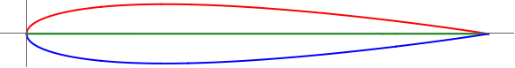

# LP-Cruise-R3  
Lift-Priority Scoring, Cruise Velocity, Run 2: 3,000,000 generations.
### Run Constants  
| V-Infinity (V∞) | Density (ρ) | angle-of-attack (AOT) |
|-----------------|-------------|----------------------|
| 135.833 m/s     | 0.7708kg/m^3| 2.1 degrees          |
### Wing Characteristics  
| Span   | Root-Chord | Min-Lift |
|--------|------------|----------|
| 11.24m | 2.67       | 27585N   |  
### Highest Scoring Individual  
**Standard NACA:** (0.01, 7.999575053, 13)  
**Generation:** 1181  

| Lift         | Drag        | Cl-2D         |CL-3D       |CD-Induced    |Score|
|--------------|------------ |---------------|------------|--------------|-----|
| 29712.20431  | 312.8125285 | 0.2323822221  |0.1772818631|0.001866438022|999687.1875|

  

### Progress Over Time  


**Number of Successful Generations:** 9  

  

### Raw-Data  
```CSV
Run 3: Cruise Speed | V-infity: 135.833 m/s | p = 0.7708kg/m^3 | a = 2.1

:thickness , 4.770000000000003 , :generation , 1181 , :positon-camber , 7.99957505303524 , :CD-Induced , 0.0018664380219776079 , :Lift , 29712.204313768005 , :corrected-thickness , 0.047700000000000034 , :score , 999687.1874714944 , :cl-2D , 0.2323822220677553 , :Drag , 312.8125285056287 , :corrected-position-camber , 0.799957505303524 , :corrected-max-camber , 1.0E-4 , :max-camber , 0.01 , :CL-3D , 0.1772818630791696 ,
:thickness , 12.120000000000003 , :generation , 1115 , :positon-camber , 3.9092522696475203 , :CD-Induced , 0.001882761621039791 , :Lift , 29841.850800733613 , :corrected-thickness , 0.12120000000000003 , :score , 999684.4516580161 , :cl-2D , 0.23255127520739585 , :Drag , 315.5483419839371 , :corrected-position-camber , 0.390925226964752 , :corrected-max-camber , 2.0E-4 , :max-camber , 0.02 , :CL-3D , 0.17805541628000976 ,
:thickness , 17.42 , :generation , 817 , :positon-camber , 4.24299444601281 , :CD-Induced , 0.0020034058838706323 , :Lift , 30783.114571653485 , :corrected-thickness , 0.17420000000000002 , :score , 999664.2318401269 , :cl-2D , 0.23377864047912988 , :Drag , 335.7681598731088 , :corrected-position-camber , 0.424299444601281 , :corrected-max-camber , 3.0E-4 , :max-camber , 0.03 , :CL-3D , 0.18367159316124762 ,
:thickness , 26.84 , :generation , 543 , :positon-camber , 6.76 , :CD-Induced , 0.002135371350806154 , :Lift , 31780.79757546736 , :corrected-thickness , 0.26839999999999997 , :score , 999642.1146034967 , :cl-2D , 0.23507957387199144 , :Drag , 357.88539650322593 , :corrected-position-camber , 0.6759999999999999 , :corrected-max-camber , 3.0E-4 , :max-camber , 0.03 , :CL-3D , 0.1896244029834589 ,
:thickness , 30.15 , :generation , 138 , :positon-camber , 2.98 , :CD-Induced , 0.0028912741718327938 , :Lift , 36980.495382325746 , :corrected-thickness , 0.3015 , :score , 999515.4262966976 , :cl-2D , 0.2418597440100737 , :Drag , 484.5737033023669 , :corrected-position-camber , 0.298 , :corrected-max-camber , 0.0011 , :max-camber , 0.11 , :CL-3D , 0.22064909926361267 ,
:thickness , 32.39 , :generation , 19 , :positon-camber , 6.98 , :CD-Induced , 0.031033736170459993 , :Lift , 121156.0534454424 , :corrected-thickness , 0.3239 , :score , 994798.7871195571 , :cl-2D , 0.3516208544313696 , :Drag , 5201.212880442833 , :corrected-position-camber , 0.6980000000000001 , :corrected-max-camber , 0.0073 , :max-camber , 0.73 , :CL-3D , 0.7228938873503461 ,
:thickness , 37.5 , :generation , 13 , :positon-camber , 5.05 , :CD-Induced , 0.08585857644378217 , :Lift , 201520.82294643344 , :corrected-thickness , 0.375 , :score , 985610.2168542324 , :cl-2D , 0.4564128693838115 , :Drag , 14389.783145767658 , :corrected-position-camber , 0.505 , :corrected-max-camber , 0.0179 , :max-camber , 1.79 , :CL-3D , 1.2024010929622118 ,
:thickness , 33.97 , :generation , 10 , :positon-camber , 4.28 , :CD-Induced , 0.4823758889150996 , :Lift , 477662.208409427 , :corrected-thickness , 0.3397 , :score , 919154.4429952183 , :cl-2D , 0.8164887132406051 , :Drag , 80845.55700478163 , :corrected-position-camber , 0.42800000000000005 , :corrected-max-camber , 0.0501 , :max-camber , 5.01 , :CL-3D , 2.8500358080162536 ,
:thickness , 28.27 , :generation , 4 , :positon-camber , 3.89 , :CD-Induced , 0.5538685208832853 , :Lift , 511836.70581553836 , :corrected-thickness , 0.2827 , :score , 907172.373024422 , :cl-2D , 0.8610507080725475 , :Drag , 92827.62697557804 , :corrected-position-camber , 0.389 , :corrected-max-camber , 0.0559 , :max-camber , 5.59 , :CL-3D , 3.0539425429717033 , 
```
